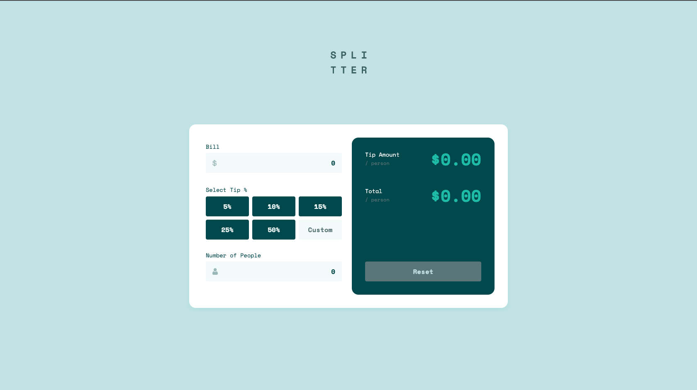

# Frontend Mentor - Tip calculator app solution

This is a solution to the [Tip calculator app challenge on Frontend Mentor](https://www.frontendmentor.io/challenges/tip-calculator-app-ugJNGbJUX). Frontend Mentor challenges help you improve your coding skills by building realistic projects.

## Table of contents

- [Overview](#overview)
  - [The challenge](#the-challenge)
  - [Screenshot](#screenshot)
  - [Links](#links)
- [My process](#my-process)
  - [Built with](#built-with)
  - [What I learned](#what-i-learned)
- [Author](#author)
- [Acknowledgments](#acknowledgments)

**Note: Delete this note and update the table of contents based on what sections you keep.**

## Overview

### The challenge

Users should be able to:

- View the optimal layout for the app depending on their device's screen size
- See hover states for all interactive elements on the page
- Calculate the correct tip and total cost of the bill per person

### Screenshot



### Links

- Live Site URL: [tip-calculator-app-fm.netlify.app](https://tip-calculator-app-fm.netlify.app/)

## My process

### Built with

- Semantic HTML5 markup
- CSS custom properties
- Flexbox
- CSS Grid
– Responsive CSS
- Mobile-first workflow
– Vanilla Javascript

### What I learned

This was a tricky task, as I decied to store all of the data in an object, instead of doing the calculations inside functions. I've seen other solutions with less lines of code, but I wanted to explore how to work with objects, and using object methods to caculatue propeties set inside an object.

For example, inside the 'data' object, I stored three values for the bill total, tip value and number of people.
```js
const data = {
    billTotal: 0,
    tipValue: 0,
    numberOfPeople: 0,
}
```

I then used a number of methods. For example, the tip amount method first checks if values are greater than 0, and then if true, they take the bill total (e.g. $100) and multiplies it by the tip percentage (e.g. 20%). This produces the final tip amount for the bill – $20.

```js
   get tipAmount() {
        if (this.billTotal > 0 && this.tipPercent > 0) {
            return this.billTotal * this.tipPercent
        } else {
            return 0
        }
    }
```

This value is returned in another method inside the 'Data' object. This value returnds the tip per person, by taking the value from tipAmount, and dividing it by the total number of people in the group.

```js
 get tipPerPerson() {
        if (this.tipAmount > 0 && this.numberOfPeople > 0) {
            return this.tipAmount / this.numberOfPeople
        } else {
            return 0
        }
    }
```

In order to inject that data onto the page, I used multiple functions, all of which are triggeted by Event Listenrs on the input and button tags.

The following snipper shows the setTipTotal function, which runs after every time a user enters a value. It removes the disabled attribute on the reset button, and sets the 'Tip Amount' and 'Total' fields to data set inside an object. To Fixed reduces a longer number down to 2 decimal places.

```js
const setTipTotal = () => {
    buttonResetTag.removeAttribute("disabled");
    tipAmountResult.innerHTML = `$${data.tipPerPerson.toFixed(2)}`
    totalResult.innerHTML = `$${data.totalPerPerson.toFixed(2)}`
}

```

## Author

- Website - [Daniel Shires Portfolio](https://www.danielshires.com)
- Frontend Mentor - [@danielshires](https://www.frontendmentor.io/profile/danielshires)
- Twitter - [@danshiresdesign](https://twitter.com/danshiresdesign)


## Acknowledgments

Shoutout to [kilelx](https://github.com/kilelx/Tip-Calculator) whose solution I used as inspiration for some of the smaller tasks – e.g. using data attributes to set the status of the reset button.
